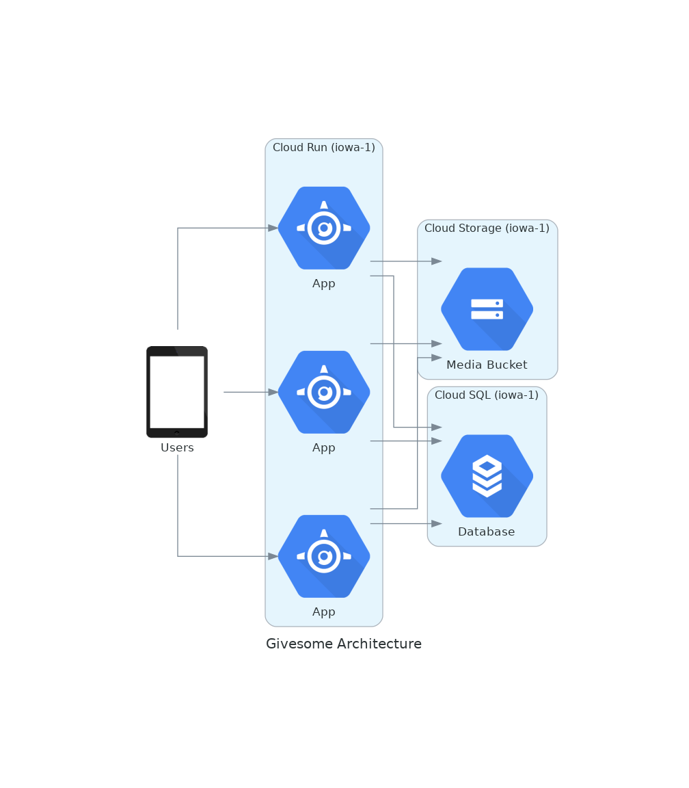

# Givesome Marketplace

See app/README.md for application README

# Building / deploying
Currently application is being migrated away from vendor, currently Dockerfile is built locally / deployed to GCP where it is run on:
Cloud Run
Cloud SQL
Google Cloud Storage

Where the Cloud Storage is mounted in the Cloud Run container which also connects out to the Cloud SQL instance:


Make sure to tag each image with the current version...

To build / deploy use:
```
VERSION=2.10.9
docker build . -f Dockerfile.live -t gcr.io/engaged-ground-343617/givesomeapp:${VERSION}
docker build . -f Dockerfile.qa -t gcr.io/engaged-ground-343617/givesomeapp:${VERSION}-qa
docker push gcr.io/engaged-ground-343617/givesomeapp:${VERSION}-qa
docker push gcr.io/engaged-ground-343617/givesomeapp:${VERSION}
```

Make sure that you are logged into the docker registry on GCP to pull the base
image


